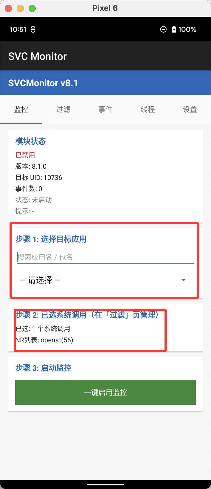
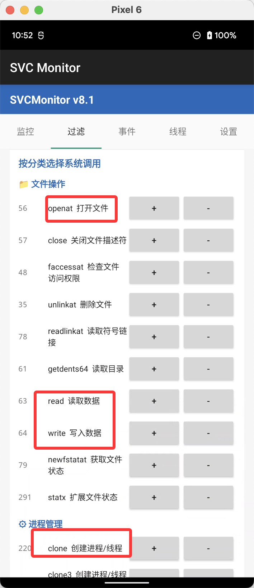
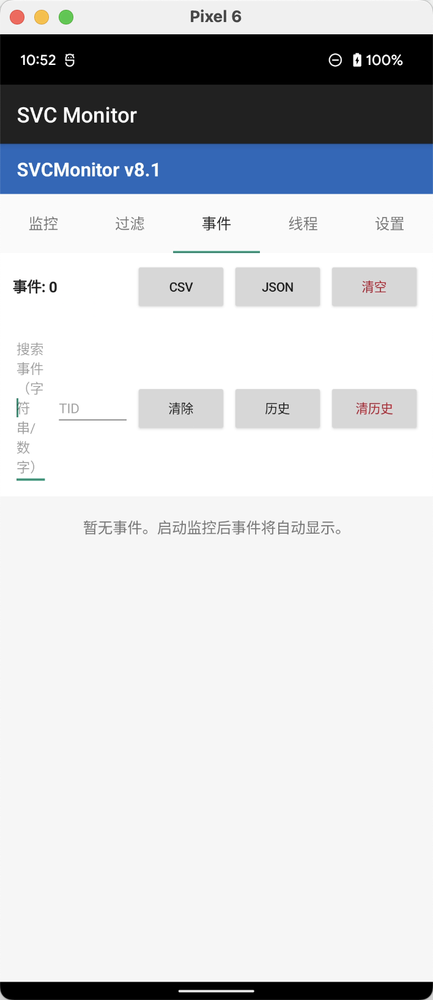
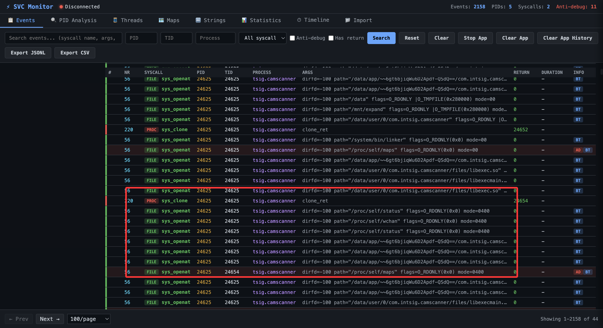
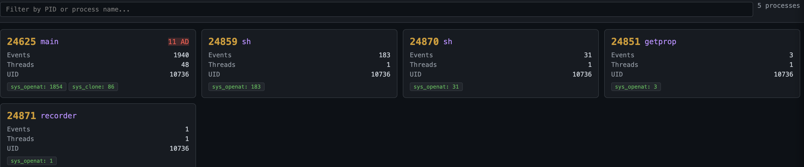
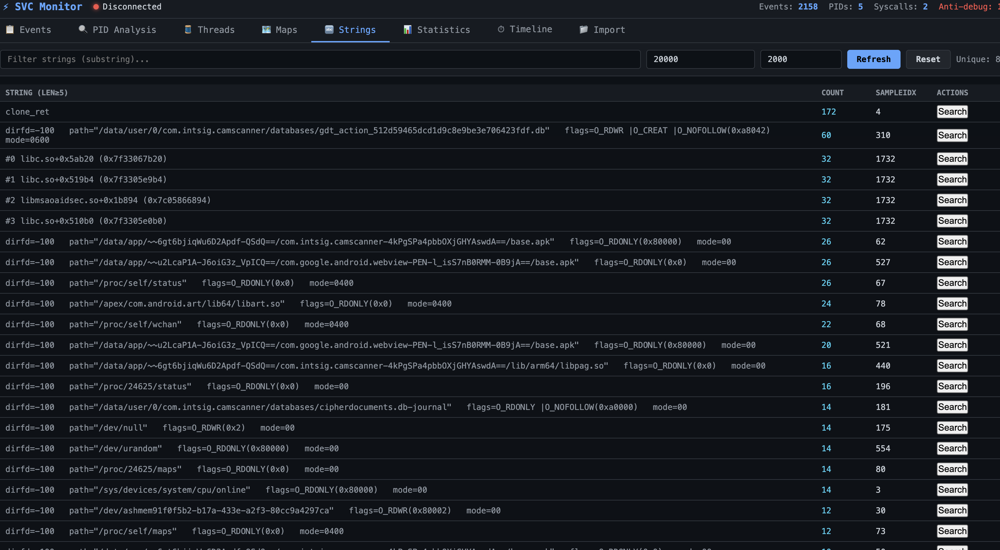
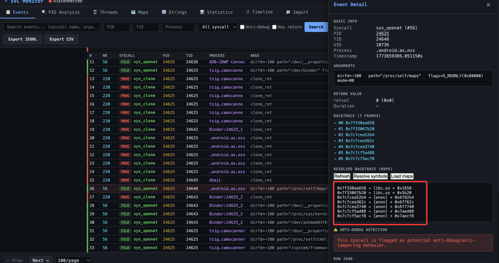

# SVC Call

ARM64 系统调用监控与逆向分析工具链：**KPM 内核模块 + Android App + PC Web Viewer**。

这套链路的定位很简单：手机端采集与解析，PC 端做检索与可视化。

## 组成

- **kpm/**：KernelPatch Module（`svc_monitor`），采集 syscall 事件
- **android/**：控制与采集 App（选择 UID、选择/管理 NR、落库、对外提供事件服务端）
- **SVC_PC_View/**：PC Viewer（Python + Web UI，WebSocket-only）

## 快速开始

- 编译/加载 KPM：见 [android/README.md](file:///Users/bytedance/Desktop/GithubProject/SVC_Call/android/README.md) 或 [kpm](file:///Users/bytedance/Desktop/GithubProject/SVC_Call/kpm)
- 安装 App：`adb install -r android/app/build/outputs/apk/debug/app-debug.apk`
- 启动 PC Viewer：

```bash
pip install -r SVC_PC_View/requirements.txt
bash SVC_PC_View/run_app_socket.sh 8080 0
```

## 功能特点

- **全量 NR 支持**：可在 App 里按 NR/名称筛选并启用/禁用（默认不预选任何 NR）
- **read/write 数据抓取**：payload hexdump + 可打印字符串提取，便于关键词检索
- **WebSocket-only Web UI**：实时增量事件流、断线重连可续传
- **事件检索与线程追踪**：关键字、PID/TID/NR 过滤；TID 面板对话式追踪
- **Strings 汇总**：统计所有出现过的字符串（长度阈值过滤），一键回到 Events 搜索
- **Maps Analyzer**：结构化 maps、权限着色、可疑区域高亮、输入地址精准跳转/闪烁定位
- **Backtrace/符号解析**：maps 级别 `lib + offset`，可选上传 so/symbol 后 addr2line 解析函数名
- **clone 目标解析**：对 `clone_fn` 做 maps 解析并支持跳转定位

## 目录结构

```
SVC_Call/
├── kpm/
├── android/
└── SVC_PC_View/
```

## 常见问题

- Web UI 走 polling：确保已安装 `eventlet`（见 `SVC_PC_View/requirements.txt`）
- Maps/符号解析失败：需要 root 权限与可选的 `addr2line/llvm-addr2line`
- App 看不到事件：确认模块已加载、App 已 enable、并已选择需要的 NR

## 使用截图

APP侧：



选择svc号






web侧：









